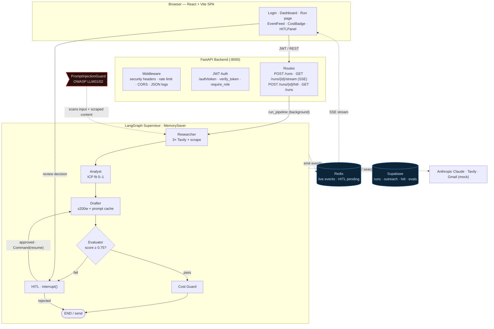

# AgentIQ

AgentIQ is an autonomous, multi-agent B2B outreach platform. A LangGraph supervisor
orchestrates four Claude agents — Researcher → Analyst → Drafter → Evaluator — to
research a target company, score ICP fit, draft a personalized cold email, and then
critique it with an adversarial LLM-as-judge. Drafts that fail the quality bar are
routed to a human-in-the-loop review gate (LangGraph `interrupt()`/`resume`) before
anything is sent, while a cost guard aborts runs that exceed a budget. It demonstrates
production patterns for agent orchestration, streaming, evaluation, and LLM security.

Architecture diagram: See `docs/architecture.png`.

## Architecture & workflow



## Stack

| Layer | Technology | Version |
|---|---|---|
| Orchestration | LangGraph | 1.2.5 |
| LLM | langchain-anthropic (claude-sonnet-4-6) | 1.4.6 |
| Search | tavily-python | 0.7.26 |
| API | FastAPI | 0.136.3 |
| Validation | Pydantic | 2.13.4 |
| Persistence | Supabase (Postgres) | 2.31.0 |
| Live state / streaming | Redis | 8.0.0 |
| Eval metrics | RAGAS | 0.4.3 |
| Auth | python-jose (JWT HS256) | 3.4.0 |
| Frontend | React + Vite + TypeScript | 19 / Vite 8 |
| Frontend state | Zustand | 5.x |
| Runtime | Python | 3.11 |

## Setup

```bash
git clone <your-repo-url> && cd AgentIQ
cp .env.example .env          # fill in ANTHROPIC_API_KEY, TAVILY_API_KEY, SUPABASE_*, etc.
docker compose up --build     # redis + backend (:8000) + frontend (:3000)
```

Apply the database schema once (Supabase SQL editor or `supabase db push`):
`backend/db/migrations/001_initial.sql`.

### Local dev without Docker

```bash
python3.11 -m venv venv && source venv/bin/activate
pip install -r requirements.txt
uvicorn backend.api.main:app --reload          # run from the project ROOT
# in another shell:
cd frontend && npm install && npm run dev       # http://localhost:5173
```

## Running tests

```bash
pytest --tb=short -v        # 46 tests; all external services are mocked
```

CI (`.github/workflows/ci.yml`) runs the full suite on Python 3.11 with a Redis
service and dummy env vars on every push / PR to `main`.

## Using the app

1. **Sign in** at `/` with a dev user (`admin` / `agentiq_admin`, or `reviewer` /
   `agentiq_review`). The JWT is stored in `sessionStorage`.
2. **Create a run** on the dashboard: company name, website, ICP notes, recipient email.
3. **Watch the stream** on the run page: the 4-step pipeline lights up live, the event
   feed shows agent output, and the cost badge tracks tokens / spend in real time (SSE).
4. **HITL review**: if the evaluator scores the draft below 0.75, a review panel slides
   in with the draft (editable body) and the evaluator's feedback. Approve or reject
   (rejection requires reviewer notes); the graph resumes from the saved checkpoint.
5. **Completion**: a summary card shows fit score, eval score, draft subject, pass
   status, and total cost.

## The agents

- **Researcher** — runs three parallel Tavily searches and scrapes the company website
  (firewalled against prompt injection), then synthesizes a structured company profile.
  Implements exponential backoff on search failures.
- **Analyst** — scores ICP fit (0–1, clamped), extracts personalization hooks, recommends
  a tone, and flags reasons not to reach out, given the research and the ICP notes.
- **Drafter** — writes a ≤200-word personalized email using the analyst's hooks, with the
  system prompt sent under Anthropic prompt caching to cut repeated-token cost.
- **Evaluator** — an adversarial LLM-as-judge scoring personalisation, clarity, and
  relevance; passes only at ≥0.75, otherwise the run routes to human review.

## Skills demonstrated

LangGraph 1.2.5 multi-agent orchestration · HITL interrupt/resume with Redis ·
LLM-as-judge evaluation · RAGAS eval metrics · Prompt injection firewall
(OWASP LLM01/02) · Pydantic v2 structured outputs · Prompt caching (Anthropic beta) ·
SSE streaming · JWT auth · FastAPI 0.136.x · Supabase · Docker Compose ·
GitHub Actions CI

## Known limitations

- **MemorySaver checkpointer is in-memory only** — interrupted graph state is lost on
  server restart. For production, swap in `langgraph.checkpoint.postgres.AsyncPostgresSaver`
  backed by the Supabase Postgres connection.
- **Rate limiter is in-memory** — the sliding-window limiter resets on restart and is not
  shared across workers. Replace with a Redis-backed limiter for production.
- **Gmail integration is mocked** (`USE_MOCK_GMAIL=true`, writes `sent_emails.jsonl`).
  Real sending needs an OAuth 2.1 flow / connected Gmail MCP; never hardcode tokens.
- **RAGAS is wired in but degrades to 0.0** in this environment: ragas 0.4.3 imports a
  `langchain_community` vertexai chat model that no longer exists in langchain-community
  0.4.2, so the import fails. The eval framework imports ragas lazily and falls back
  gracefully. To enable real RAGAS scoring, install `langchain-google-vertexai` (or bump
  langchain-community) and provide an LLM + embeddings.
- **No multi-tenancy** — all runs share one namespace in Redis and Supabase.
